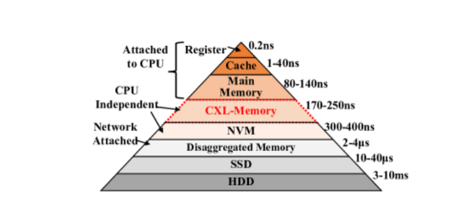
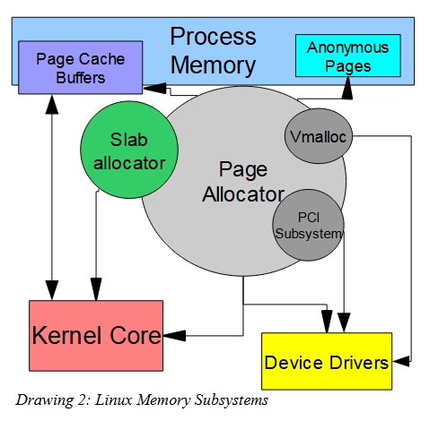
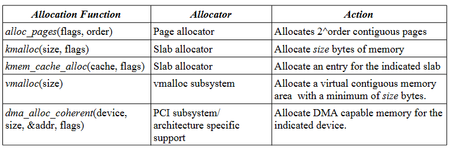
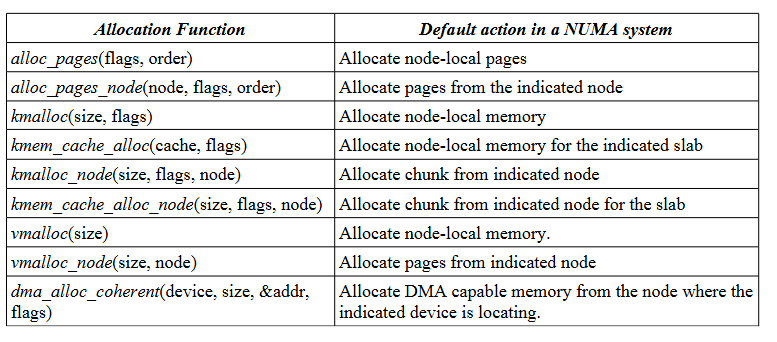
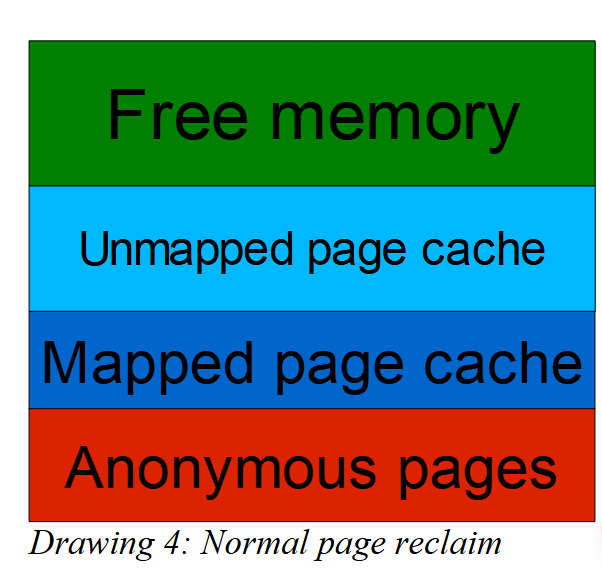

對於大多數系統，記憶體之間沒有什麼差別，每個記憶體分頁都和其他分頁一樣好，但是在 NUMA 系統中，記憶體和目前正在執行的 process  之間的距離是需要考慮的，如果一個 process 不斷的存取遠端節點上的頁面，則很有可能導致效能大幅下降。對於 NUMA 系統需要特別考慮本地記憶體，因為他具有最小延遲以及最佳頻寬的特性。

kernel 有個很重要的任務便是為 process 分配記憶體，使得該 process 能夠以最高效能執行，此外，kernel 有許多機制可以用來確認節點的位置，目的是為了確保以最小化 NUMA 距離的方式分配記憶體，在執行 process 期間，locality 可能會受到許多因素影響，如 scheduler, memory allocation 等等，因此 kernel 需要能夠在 process 執行時移動記憶體頁面，這稱為 [[page migration (頁面遷移)]]

關於記憶體分配也可以通過 process 本身建立記憶體的策略進行控制，例如 process 可以知道使用的記憶體位於哪一個節點等等。

### [[NUMA]]
NUMA 為非一致性記憶體存取，隨著處理器數量增加，NUMA 技術越來越重要，因為處理器數量增加對於構建 UMA 系統會變得越來越困難，NUMA 系統與一般具有多處理器的常規系統差別在於一些記憶體是屬於處理器的本地記憶體，可以有最小的延遲時間和最高 throughput，而其他記憶體屬於遠端的，性能上不如本地記憶體，延遲更大，更小的 throughput。

下面將會介紹在沒有 NUMA 情況下記憶體管理是如何運作的，然而看到記憶體管理機制在考慮 NUMA 的情況做出了哪一些調整，接著是高效率分配記憶體會遇到的問題，然後討論本地記憶體回收以及記憶體遷移的問題。

最後看到 Linux process 如何手動控制 NUMA 系統中記憶體分配，使用的方法首先是 memory policies，以及 cpusets。

### Example of NUMA system
對於 SMP (Symmetric Multi-Processor) 以及 UP (Single Processor) 系統來說，記憶體是統一的，也就是存取所有記憶體有相同的成本。在 NUMA 系統中會因為 NUMA 距離而有所差異，優化 NUMA 系統上執行的應用程式本質上我們希望以最佳效能的放置應用程式使用到的資料結構等等。

關於 NUMA 距離 (NUMA distance)，kernel 會藉由 ACPI (Advanced Configuration and Power Interface) 以及 SLIT (System Locality Information Table) 來獲得。根據 ACPI 的標準，SLIT 表中用於常規 SMP 模式的記憶體存取和本地 NUMA 距離的值被標準化為 10，也就是本地記憶體存取定義為 10，其他距離會根據這個相對值來決定，例如跨節點的 NUMA 存取距離會比 10 還要大。



上面這是一張 NUMA 模型圖，灰色為一個 NUMA 節點，這一些 NUMA 節點藉由 NUMA Interconnect 來連結。每一個 NUMA 節點有兩個 processors，以及一個 local memory 和 cachelines

假設如圖所示，有一個 process 在 Node 2 上面的 4 號 CPU 上面執行，如果我們存取本地記憶體，則 NUMA 距離為 10。該 process 在 Node 2 上面執行，因此放在 Node 2 上的記憶體對於我們來說就是本地記憶體，距離為 10，這是可能的最小 NUMA 距離。

如果 CPU 4 上執行的 process 要存取 Node1 上面的記憶體，則需要通過 NUMA interlink 進行存取，並且需要將結果移動回到本地，這比起存取本地節點上的記憶體來慢的許多。假設存取 Node1 上面記憶體的 NUMA 距離為 14，表示[[遠端存取]] 是本地存取的 1.4 倍。NUMA 距離是抽象概念，會隨著硬體技術和 NUMA 互連速度有所改變，較快互連速度可降低遠程存取的延遲。

在使用 NUMA 節點時也需要特別注意該節點外聯的 I/O 設備，例如在 Node1 上面執行的 Process 不需要經過 NUMA interlink 來存取外部設備，同樣的 Node4 也有差不多的狀況。

### 關於 Linux Mememory Management



上面是簡單的 Linux Memory Management 的概念圖，核心部分為為 page allocator，page allocator 以 page 為大小分配一塊又一塊的記憶體。

通常 page 大小為 4KB，在 Itanium 上面可能為 16k。所有其他記憶體分配器都是某種程度上基於 page allocator 的，並且從 page allocator 管理的 pool 中取出頁面，頁面可以映射到 process 的 virtual memory space 中，通常映射到 userspace 的 page 有兩種使用方式

1. 一種是用於 anon page 或是說 [[anon memory]]，不和檔案關聯，通常用於變數，stack, heap 等等，anon page 比較輕量，通常比 file backed pages 還要高效，因為不需要映射到記憶體 (映射到記憶體的頁面需要經過序列化才可以存取)。如果記憶體不足時，可以將 anon page swap 出去，不過這會增加未來處理該頁面所需要付出的開銷
2. 另外為 page cache 或是 buffer, 通常這一些會儲存在一些輔助儲存媒介上，如硬碟等等，如果記憶體面臨壓力或是資源不足時，則 page cache 可能被移除，因為 page cache 可以之後通過硬碟進行恢復。page cache 包含 process 中的可執行程式碼，可執行程式碼可以通過 mmap 映射到其他 memory space 中。

kernel 本身也需要一些 page 來儲存一些 meta data，如用於 fs 的緩衝區，此外 kernel 還需要為不同大小的 struct 分配記憶體，這些結構使用的單位可能不是以 page 為大小。為此，有了 slab 分配器，slab 分配器從頁面分配器中查詢單個 page 或是連續的 page，接著運用自己的內部邏輯，根據 kernel 或是 driver 分配不同大小的記憶體區塊。 slab 分配器使用了許多高校緩衝技術，對於小物件的記憶體分配來說，性能非常的好。slab 主要用在檔案被開啟的相關訊息，或是最近使用的檔案名稱，把這一些資訊緩衝起來加速 fs 查詢操作，或是其他如 kernel 中用的 lock, 某些物件的狀態等等。

device driver 會利用 page allocator 以及 slab allocator 來分配記憶體和管理 device，device driver 根據所需要的 page sized 還有其他不同的變體，如 vmalloc，可以分配比較大的記憶體 chunks，這些記憶體塊在 kernel context 中看起來似乎連續，但實際上在物理上並不是連續的。vmalloc 可以為大塊記憶體產生出幾乎連續的記憶體。vmalloc 即便遇到系統碎片化等問題，如果 page allocator 無法提供物理上連續的記憶體，這時候就可以使用 vmalloc 處理。vmalloc 在 kernel space 上記憶體連續，但是在物理記憶體地址上不是連續的。但 vmalloc 也有其缺點，通常需要通過 page table 進行轉換，與直接從 page allocator 或的物理地址相比，這樣轉換多了 overhead，且 vmalloc 只能用在 kernel 中，無法映射到 userspace 的程式。

對於 PCI 設備，通常會使用 dma_alloc_coherent 函數，這是專門用於 DMA 操作的記憶體，DMA 記憶體有幾個特點，例如一致性，DMA 記憶體對 CPU 和 PCI 等設備保持一致性，這表示不需要額外的 buffer 或是 cache 用來同步操作。不同硬體平台對於 DMA 記憶體要求可能˙不同，如記憶體對齊，記憶體地址範圍或是映射方式，dma_alloc_coherent 獲得的記憶體很大程度依賴於底層硬體實現。有些硬體可能支援使用 Huge Page 提升 DMA 效能等等

以下為關於 Linux 記憶體分配的相關 API



### 關於 NUMA 記憶體
在 NUMA 系統中每個節點的記憶體是單獨管理的，每個節點都存在於 page pools 中。每個節點都與 swapper thread 所關聯，用來處理記憶體回收。節點中的每個記憶體地址範圍稱為分配區域。

在 Linux 中有一個機制稱為 zone structure, 裡面包含 free list 存放可以使用的記憶體分頁，zone 結構是 Linux kernel 用來組織以及管理物理記憶體的一種結構
- ZONE_DMA: 低記憶體地址記憶體，用來支援需要特定記憶體區域的 DMA device
- ZONE_NORMAL: 普通記憶體區域，用於 kernel 和 應用程式的記憶體分配
- ZONE_HIGHMEM: 主要用於 32 bit 系統
而回收策略部分，使用 active list 以及 inactive list 管理回收機制，page 會在這兩個 list 之間移動以確認哪一些 page 可以回收，如果存取位於 inactive list 裡面的 page，則該 page 會移動到 active list。swapper 會將 page 從 active list 移動到 inactive list，如果遇到記憶體資源吃緊時，會從 inactive list 末端開始回收 page。

如果我們在 NUMA 上發出請求分配記憶體的請求，我們將需要決定從哪一個節點上的哪個 pool 去得到記憶體。如果沒有 cpuset 限制，NUMA 系統會嘗試將記憶體分配到 process 正在執行的節點上，原因為新分配的記憶體通常在分配之後很常被使用，這個結論可以從 [[TPP Transparent Page Placement for CXL-Enabled Tiered-Memory]] 得知，因為他是 hot 的，把他放在本地記憶體是合理的。

但有可能我們需要的記憶體超過目前節點所能夠提供的數量，我們需要某一些機制讓我們能夠指定記憶體應該分配在哪一些節點，避免單一節點過載等等。或是一些特殊場景，如 driver 開發者已經知道某個資料結構不會那麼常被存取，或是其他節點會更頻繁的存取該結構，則分配在本地節點就不會是最佳解了。為了應對更佳玲羅的需求，NUMA 中會有帶有 `_node` 後綴的函數，為 NUMA 系統使用的分配器，例如 kmalloc_node() 可以直接分配記憶體在目標節點上。以下表格整理了 NUMA 相關記憶體分配器



### 最佳應用 NUMA 的應用程式特徵
只利用單一節點資源的小型應用程式可以利用本地節點的所有元素來實現最佳速度執行。這個應用程式如果使用的記憶體不超過單一節點可以提供的記憶體量，且使用的 CPU 數量不超過一個節點可以提供的 CPU 數量。

### 關於多節點應用程式
如果本地節點的資源不足以供應給一個應用程式使用，則我們勢必需要存取到非本地節點的資源，對於應用程式中的資源，大致上可以分成 Thread specific data, Shared read/write data, Shared read/only data 這三種，這三種有以下幾種最佳分配記憶體的方式可以參考

- Thread Specific Data: 當資料只被本地處理器存取時，可以把它視為本地的資料，因為 Thread Specific Data 不需要跨節點進行存取
- Shared Read/Write: 如果某些資料被所有節點以相同的機率存取，那麼最好的方法就是把資料均勻地分布在所有節點上。這種分配策略通常會通過 interleave memory 或是 memory spreading 實現
- Shared Read/Only: 當資料是高頻率的 Read/Only 時，最好的策略是讓每一個節點都有一份自己的拷貝，這樣每一個節點只要從自己本地節點讀取就可以，省去了跨節點存取的開銷。但需要注意 Linux 不支援直接進行資料的自動複製管理，而是使用 interleave memory 或是 memory spreading 來處理所有 Shared Data。如果應用程式需要這樣的功能，通常需要自己實現
### 關於 Linux 中 Interleave Memory, Memory Spreading
Interleave Memory (記憶體交錯): 概念上是將記憶體以 block 的形式平均分布在 NUMA 節點上，每一個 memory block 由不同節點負責存取，從而實現存取上的負載平衡。當多處理器需要頻繁的存取一段記憶體時，使用這個方法可以降低單一節點記憶體控制器的壓力。

在 Linux 中 NUMA 策略中的 interleave 模式可以使用 `numactl` 工具來設定，詳細 usage 為以下
```shell=
numactl --interleave=all ./program
```
`--interleave=all` 指定記憶體將均勻分布在所有 NUMA 節點上

在 Kernel 的部分，我們可以使用 `alloc_pages_interleave()` 來使用 Interleave Memory 的策略，或是 `mbind_range` 等等，詳細可以參考 kernel source 或是 libC 裡面的 [`numa.h`](https://linux.die.net/man/3/numa) 

Memory Spreading: 概念上是將記憶體分散到多個節點，但是不會像是 Interleave Memory 那樣以固定交錯模式分布。分散的記憶體分布可以考慮更加靈活的條件，例如節點目前的負載程度等等。可以應用在避免節點資源耗盡，保持系統整理記憶體使用均衡，概念有點像是 Interleave Memory。

在 Linux 中通過 autoNUMA 實現 Memory Spreading，這通常不需要顯式設定。

如果要手動設定，可以使用以下方式進行設定
```shell
numactl --preferred=0 ./program
```
在上面案例中，優先從節點 0 分配。當節點 0 無法滿足需求時，其他節點的記憶體會作為備用。

kernel 裡面 NUMA 平衡機制有位於 `mm/page_alloc.c` 裡面的 `find_next_best_node` 

對於 NUMA 控制，libC 也有提供一些介面給應用程式使用，如 `numa.h` 裡面的 `numa_set_interleave_mask`，或是使用 `numactl` 這個工具進行控制。而與 kernel 相關 NUMA 控制有 `cat /sys/devices/system/node/node*/meminfo`。對於 NUMA 平衡，有 `echo 1 > /proc/sys/kernel/numa_balancing` 

### 關於 page cache
當 Linux 從硬碟裡面讀取資料時，這些 page 會被 cache 到記憶體裡面，而這部分的記憶體就被稱作 page cache。page cache 主要是用來提高系統效能，減少硬碟 I/O 操作的次數。page cache 不只是用來做 cache，還有以下用途

1. Executable Pages: 當程式需要執行某些從硬碟載入的二進位檔案時，這些頁面可能被映射成可執行頁面，也就是從硬碟讀取資料時，這些 page 被 cache 到記憶體裡面時，page 本身具有執行權限
2. Memory Mapped Pages: 某些程式可能會使用 memory-mapped-files，也就是把檔案映射到記憶體，從而實現檔案到記憶體之間的對應，可以直接使用記憶體相關 API 去處理檔案，通常這種方式會用於處理大檔案或是共享檔案。
page cache 中的某個 page 被映射到某個 process images 之類，即便該 process 被 kill 了，這一些 page 也不會被立即釋放，這一點和 [[anon memory]] 有所不同，也就是 page cache 具有某部分的持久性

- 當一個 process 結束之後，page cache 會繼續留在記憶體
- 這樣的設計是基於空間局部性的考慮，也就是未來可能有其他 process 會需要相同的 page，這些 page 和硬碟的資料有關，基於這樣的假設，之後的 process 就可以減少對於硬碟的 I/O，直接從 page 拿資料，提高系統效能。舉例來說，如果有另外一個 process 需要存取相同的檔案內容，process 可以直接從 page 撈資料。但是當記憶體壓力大時，這一些 page 可能被替換掉，可能是基於 LRU 或是其他策略

### 關於記憶體回收
以下為 UP 系統以及 SMP 系統簡單的記憶體映射情況



由 process 映射的頁面是 anon page 和 page cache page。當 process 被 kill 時且已經映射的 page cache page 變成未映射的 page cache pages 時，記憶體裡面隨著時間推時會有越來越多的未映射 page cache pages，也就是這一些 page cache 不屬於任何 process，導致 Free memory 減少。

當 Free memory 低於作業系統限制時，swapper 開始回收記憶體，如果壓力比較低，且 swapper 運作的頻率並沒有那麼頻繁，則只會釋放 inactive list 裡面的未映射頁面，這樣可以提高 Free memory，且累積的未映射快取頁面可以重新的被利用。

如果記憶體壓力增加，swapper 可能會更加激進，例如取消映射到 process 的頁面，或是把 [[anon memory]] 交換到 swap space 中。

### 關於 NUMA 的記憶體回收
在 NUMA 系統中，很少發生全域回收，也就是針對於所有節點的回收機制。因為要觸發全域回收的前提是所有節點記憶體都耗盡，才會觸發 swapper。

因此當 Node1 上記憶體耗盡時，標準的 swapper 是不會運作的，因為其他兩個 Node 還有大量的 Free Memory。假設 Node0 沒有足夠的記憶體，可能在 Node0 上面執行的 process 所使用的 [[anon memory]] 等等會在其他節點上，如 Node1。這樣會造成存取延遲。而 NUMA 隨著時間推進，也會面臨到大量記憶體被 unmapped page cache page 所佔用，因此到最後可能會觸發全域回收，但全域回收會影響效能。

對於大型 NUMA 系統，有更多的節點和更大的記憶體，觸發全域回收的頻率會更小，但是大型 NUMA 系統更多節點表示有更長的存取路徑，導致更大的 NUMA 延遲。過去為了快速釋放記憶體，會直接全域回收 unmapped page cache page，雖然可以馬上獲得大量的 Free Memory，但是對其他節點會造成不良影響，因為他們可能需要重新從硬碟讀取剛剛被清除了 page (這裡連接到剛剛的空間局部性，雖然是未映射，但是之後 process 可能還是會用到該 page，減少 I/O，但是回收之後這樣就失去 page cache 的意義了 )，而且假設硬碟只有連接到一個 Node，對於其他 Node 復原頁面的開銷會變得十分的巨大，且對 I/O 以及直接連接到 I/O 的 Node 帶來非常大的負擔。

對於 Linux，引入了區域回收試圖解決上面這一些問題。當目前 Node 局部記憶體不足，系統會嘗試輕量回收，也就是只釋放未映射的 page cache page，不去影響 anon page 或 active page。區域回收會優先在本地的 Node 做，除非無法滿足記憶體需求時，才會考慮去對其他非本地記憶體做操作。

回收本地的 page cache page 是有道理的，page cache page 考慮的是接下來 process 可能會考慮空間局部性用到差不多的檔案，以達到減少 I/O 的作用，但是當記憶體不足時，連 process 都無法載入了，因此優先將 page cache page 釋放，滿足在本地載入 process 的需求，且讓 [[anon memory]] 等等內容都留在本地。

關於 Linux 的區域回收機制，可以參考以下 `/proc/sys/vm`
- `/proc/sys/vm/zone_reclaim_mode`:  用來控制是否啟用區域回收，區域回收就如同上面所說，用於嘗試在本地釋放 unmapped page cache page。當 NUMA 距離不大，存取延遲不明顯時，系統預設關閉 zone_reclaim_mode。如果延遲較高，則會啟用，設置為 1
- `/proc/sys/vm/zone_reclaim_interval`: 用來控制如果沒有成功回收本地的記憶體時，暫停進一步回收的時間，時間單位為秒，也就是暫停進一步掃描本地節點中可回收的記憶體，並在給定時間之後再繼續嘗試

### 關於 NUMA Interlink 的限制
最上面架構我們可以看到 NUMA 架構中，節點之間的記憶體存取可以通過 NUMA interlink 完成，但是這個機制會有以下限制
- [[cacheline]] 限制: 每個 NUMA 節點只能 cache 有限數量的來自於其他節點的 [[cacheline]]，如果超過這個限制，[[cacheline]] 會被頻繁的替換，導致需要反覆從遠端節點獲得資料，增加存取延遲
- 請求處理能力限制: 每個節點能夠處理跨節點的需求是有限的，當需求過多時，會導致延遲大幅增長，變成瓶頸
- NUMA interlink 本身頻寬有限，當多個 process 同時存取遠端記憶體時，可能會出現競爭，進而減少了每一個請求的 thoughtput，增加延遲
### CPUset 控制 [[page migration (頁面遷移)]]
cpuset 用於將 process 與特定的 CPU 和記憶體節點綁定，cpuset 包含多個檔案，如 mems, tasks, memory_migrate, mems 定義該 cpuset 可以存取的記憶體節點集合, tasks 列出該 cpuset 中的 process id。對於遷移整個程式的 page 概念上為把該程式的所有 process 都加入到同一個 cpuset 中，接著修改 `mems` 檔案中記憶體節點集合，如果 `memory_migrate` 是啟用狀態，則頁面會被自動遷移到新定義的節點。如果是要遷移單個 process 的 page，則將 process 的 pid 寫入到 tasks 檔案中，將該 process 移動到新的 cpuset 中。kernel 會自動進行遷移

對於 page migration 除了使用 CPUset 控制以外，也可以使用 migratepages 這個套件，這是 numa_migrate_pages syscall 的前端。

### 更多關於 CPUset
cpuset 為 cgroup 的子系統，用於將系統中多個節點劃分成節點集合，從而為應用程式提供獨立執行環境
- 資源隔離: 每個 cpuset 可以限制 cpu 和記憶體限制範圍，應用程式在一個 cpuset 執行，其記憶體分配就被限制在 cpuset 所管轄的節點內，通過這樣的方式，實現 process 存取本地資源
- 應用: 可以應用於多節點系統上如 NUMA 上面執行多個大型應用程式，並對資源獨立管理
cpuset 提供了記憶體分配控制的功能，如 memory spreading 以及 [[page migration (頁面遷移)]]
- memory spreading: 如果啟用記憶體分散功能，如 `memory_spread_page` 或是 `memory_spread_slab`，記憶體分配會使用類似於 round robin 的方式，在 cpuset 範圍內的所有節點分配記憶體
- 如果所有應用程式都位於同一個 cpuset，則整個應用程式可以作為一個單位進行 page migration，可以應用於 NUMA 節點資源的管理，或是對於某些應用程式無法感知 NUMA，無法自行優化其記憶體分配模式，就可以使用此方式降低單一節點記憶體過載問題。

至於要不要分散記憶體分部，可參考上面說到的應用程式中常見的資料模式，如 read/only, write/only 等等

### 需要面臨的問題
- cpuset 和子系統交互可能有問題，如對於 slab 分配器，會使用 array 等去維護自己記憶體的 locality，當 cpu 限制分配節點時，可能導致 slab 沒辦法按照其原本設計從特定節點分配記憶體
- 當 slab 釋放 cache，如 icache 以及 dentry，通常需要釋放大量物件才能夠回收足夠頁面，具體問題描述如下

slab 分配器為 kernel 中分配機制，用於管理小型，頻繁分配和釋放，短生命週期的物件。他將記憶體分割成固定物件大小的 page 或 cache，如 icache, dentry。slab 會根據每個 page 儲存的物件數量決定什麼時候釋放記憶體，當 cache page 只有少量沒使用的物件時，這可能會非常的低效，如 slab 頁面有 10 個物件，只有一個物件還在使用，剩下 9 個都已經釋放，該頁面還沒辦法被釋放，導致 slab cache 有大量內部碎裂化的問題

另外是回收侷限性，如果記憶體不足或是壓力大，slab 會回收 cache page，但是回收策略可能不僅線單一節點或是具體 slab cache page。通常回收會是全域的，這可能導致回收物件分配在多個 slab page, 而不是集中回收

如果回收過多 slab cache 的物件，是否會破壞 cache 的 locality，影響未來的效能

上面問題解決方向，大部分會往更細粒度的回收策略進行，希望有一些 API 讓我們可以區分一些情況，針對情況去優化等等