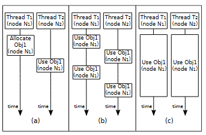

# MemProf: a Memory Profiler for NUMA Multicore Systems
source code: https://github.com/Memprof/module
### 目標: 
這篇論文是在開發 MemProf 工具，這個工具可以用於分析在 [[NUMA]] 架構底下的應用程式記憶體使用分析，可以提供應用程式在存取遠端記憶體時涉及的 [[thread]] 以及物件的資訊

### 分析的應用程式: 
四個應用程式，分別為 FaceRec, Streamcluster, Psearchy, Apache

### 什麼樣的 workload 下 MemProf 表現得不錯? 
具有任意生命週期的物件或是不同粒度大小的物件，或是應用程式對於記憶體的存取模式會隨著時間變化的，記憶體管理使用自定義策略的應用程式

### 為什麼需要 MemProf: 
NUMA 相比起 UMA，會有記憶體存取的問題，如果我們嘗試存取不在目前 group 底下的記憶體，而是去存取其他 group 底下的記憶體，就會有顯著的時間開銷，換言之，對於 NUMA 架構下執行的應用程式，遠端存取記憶體的操作會嚴重的影響性能，舉例來說，在 node 2 上面執行的 process 去存取 node 1 的記憶體，這是論文中對於遠端存取的定義。而 group 的定義在 Linux 中 node 的定義是相同的，在傳統的 profiler 如 OProfile, Linux Perf, VTune, Memphis 等工具沒有提供關於 NUMA  記憶體存取的資訊，也就是應用程式在哪一個節點上執行，在某個時間點存取了什麼物件，且這個物件位於哪一個節點。

雖然上面提及的這一些 profiler 有一些可以提供關於 global static memory object 的存取資訊，但是對於實際上的 workload 而言，這一些物件存取比率佔據所有記憶體存取事件中不到 4% 的比例，而對於非 global static memory object 的存取，上面提到的這一些分析器使用的方式是找一個目標記憶體地址，也許這個記憶體地址關連到某一個物件，然後追蹤這個記憶體地址涉及的存取指令。

而 MemProf 相比起上面這一些工具，可以針對一個遠端的記憶體地址在被存取時所關聯的 thread 以及 object

### MemProf 實作部分
實作上依賴於 kernel module 用來蒐集資訊，以及使用一些 user space 上的 library 作一些資訊塞選，filiter 的操作。對於監聽記憶體存取事件，MemProf 使用 Instruction-Based Sampling (ISB) 的技術進行採樣

### 定義應用程式對於 NUMA 性能負面影響的存取模式

- 第一種情況 (Remote usage after allocation) :當一個物件的記憶體是由 T1 所分配，分配的物件位於 N1 上，接著之後這物件被 T2 所存取，並在 N2 上面執行，這種存取模式通常會出現在具有生產者，消費者模型的應用程式中。要優化這個情況最簡單的方式就是直接把物件的記憶體分配在 N2 上，通常這種解法需要使用 NUMA-aware allocation functions 來達成，另外一種方式就是在 T2 開始存取資料之前通過 system call 去搬移資料，前提是不能夠帶來更大的 overhead 或是可以平均的分攤掉這個 overhead，像是 `move_pages`
- 第二種情況 (Alternate remote accesses to an object): 有多個 thread 隨時間變化去存取一個物件，以圖上的例子是有 T1, T2, T3 等等，而物件位於 N1 上，一個可以使用的作法是將 T1, T2, T3 綁定到 N1 上面執行，這一點可以用 CPU affinity 設定，如此可以避免 remote memory access，具體的作法為 thread 的 CPU affinity 設置只能在 N1 上面的 4 個核心上面執行，假設 N1 上面有 4 個核心，則 T1, T2, T3 嘗試存取該物件時，因為 thread 綁定在 N1 上，記憶體存取屬於本地存取。或是如果存取有一定的時間規律性，我們預測並根據時間預先對物件進行遷移
- 第三種情況 (Concurrent remote accesses to an object): 一個物件在一個時間段被多個執行序並行存取，如果我們使用之前的優化方式，直接將 T2 綁定在 T1 上面執行，可能會發生負載嚴重不平衡的情況。另外一種方式就是將該物件複製到多個記憶體節點上，但也會延伸出我們需要同步多個物件的問題，這個方法可能適用於唯獨物件中才能夠使用。如果 N1 的記憶體控制器已經飽和 (這一點可以通過評估計算記憶體的平均存取延遲時間來探測)，則可以考慮兩種最佳化的方式。第一個是平衡多個記憶體節點上不同最熱物件的分配，達成負載平衡，但是如果這樣的飽和情況是因為幾個大物件所引起的，則可可以將某一個這個 class 所分配的物件交錯分配在不同節點上，這樣優化可能可以降低記憶體存取延遲，或是盡可能的保持低延遲

### 在 NUMA 架構下的應用程式，主要會與性能相關的物件以及行為
- 全域靜態分配的物件
- 動態分配的物件
- 記憶體映射物件
- 作業系統映射的二進位檔案的部份，如某一些 binary 或是動態函式庫
- thread 的 stacks

### Object lifecycle tacking
關於物件和 thread 的生命週期以及記憶體存取的追蹤方式，為 overload 記憶體相關分配函式，如 (`malloc`, `calloc`, `realloc`, `free`, `mmap`, `mummap`) 等等函式，如此就可以進行動態追蹤，具體的實做方式是通過 `LD_PRELOAD` 以及 dlsym 將要分析的應用程式與 MemProf 提供的 share library 連接所執行。

對於 code sections 以及 global static variables 的生命週期追蹤，MemProf 實做的方式是通過 kernel module 進行處理，這個 kernel module 會 overload `perf_event_mmap` 這個函式，之所以選擇 overload 這個函式，是因為每一次 process 建立的時候，當 binary 或是 library 要映射到該 process 的記憶體空間時都會呼叫此函式。

> 做 profiling 時，可以使用 kernel module 搭配 `perf_event` 系列的 API 去得到一些資訊

### AMD IBS 採樣

### 關於 overhead
主要開銷來自於 IBS 採樣頻率，對於採樣等等，需要去測量需要多少週期

另外一個開銷來自於 trace user lib 和 kernel module trace 所帶來的開銷，攔截 user lib 並處理需要大約 400 的 clock，需要計算儲存這一些事件需要多大的緩衝區。

### 關於 NUMA Profile 的相關工具
Memphis: NUMA 效能問題分析器，依賴於 IBS，主要找遠端存取的記憶體
VTune: 使用 PEBS，主要找遠端存取的記憶體地址
Dprof: 找到不良快取行為的物件
Oprofile 和 Perf: 使用 performance counter 去定位遠端存取的函式或是 asm code.

Linux Kernel 裡面改進 NUMA 效能的 API 包含 cpusets 可以讓應用程式強制執行全域記憶體的策略，概念上就是強制硬程式在一有限的節點集合中分配記憶體，或是前面提到的 `move_pages` 可以用來做物件的遷移等等。

在考慮記憶體遷移問題時，最好也順便遷移他的 working set。

### 論文結論: 
NUMA 架構底下，應用程式中遠端存取記憶體會有大量的開銷，MemProf 可以在上面所敘述的 workload 底下表現良好，MemProf 的限制為很依賴於程式設計師對於問題的判定能力以及 MemProf 主要適合應用在 cache 效率低且大量記憶體存取的應用程式

為什麼這一些 workload 足夠有代表性，這一篇論文在方法論上面有什麼創新? benchmark 是怎麼做的? 稍微掃過一次他的實作，感覺裡面有很多目前 eBPF 實作上使用到的技術